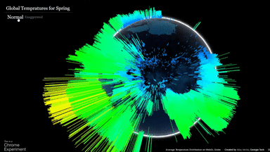

# Global Temperature Distribution on WebGl Globe

This project was created as a part of [Capital One's Geographic Data Visualization Contest](https://www.mindsumo.com/contests/global-data-visualization). The goal was to create a data visualization that used an api or global data set to show the data on the [WebGl Globe](https://www.chromeexperiments.com/globe). For my globe, I decided to display temperature values. The dataset I used can be downloaded from [here](http://bulk.openweathermap.org/sample/daily_14.json.gz). A live version of the project can be found [here](https://nilaymehta.github.io/projects/cc/tempdist.html).

## Filtering the Dataset

The Python script used to filter the data set is [filterdata.py](https://github.com/NilayMehta/webgl-global_temp_dist/blob/master/filterdata.py).

The dataset had over 22,000 lines and was over 93mb in size. Each line was sixteen data points for one geographic location. A sample line from the dataset looks like(formated to make it easier to read):

```json
{"city":{"id":1283240,"name":"Kathmandu","country":"NP","coord":{"lon":85.316666,"lat":27.716667}},
    "time":1394865585,
    "data":[
        {"dt":1394863200,"temp":{"day":287.12,"min":279.51,"max":287.77,"night":279.51,"eve":284.21,"morn":282.3},
        "pressure":707.69,"humidity":41,"weather":[{"id":800,"main":"Clear","description":"sky is clear","icon":
        "01d"}],"speed":0.53,"deg":193,"clouds":0},
        {"dt":1394949600,"temp":{"day":285.09,"min":276.88,"max":28509,"night":276.88,"eve":280.7,"morn":277.61},
        "pressure":707.85,"humidity":42,"weather":[{"id":801,"main":"Clouds","description":"few clouds","icon":
        "02d"}],"speed":0.4,"deg":194,"clouds":24},
        <--(repeated_14_times_for_each_coordinate)-->
        ]
}
```

The three main data entries I wanted to extract from each line were the latitude, longitude, and temperatures. The filtering algorithm works by splitting each line into smaller strings based on the location of quotation marks and storing those string in an array. For each relevant data entry I wanted ot extract like longitude or temperature, I would seach each entry of array for keywords like "lon" or "day". If the string contains these words, I would access the next value in the array and strip it of formating punctuation like brackets, commas, and colons. This value would represnt the correct data point and would be stored into the appropriate array for the data type. The latitude and longitude were limited to the tenth decimal place to preent rendering issues with the WebGl Globe. For the temperatures, I averged the 16 entries before commiting it to the array. In the rare off chance that the data did not ling up or the index was incorrect, I added a ValueError exception in all of my data extraction loops to ensure that if one value was off, then that entire data point would be discarded. This made sure the arrays lined up with the correct latitudes, longitudes, and temperatures. As a check to make sure all the data lines up, I inserted print statements to confirm that each individual array of latitudes, longitudes, and final temperatures were all equal. A total of 16 of the 22,000 data points were thrown out because of this mismatch of values.

## Normalized and Exaggerated Temperatures

While creating functions to normalize the temperature, I used Scipy Stats, numpy, and matplotlib to plot the temperatures and tweak the formula for both the normal and exaggerated visualizations. The "exaggerated" data set was created to make the data more visually interesting and works by scaling the differences between the temperature data. The graphs of the final distribution of the data set are shown below.

Normalized data:


Exaggerated data:

